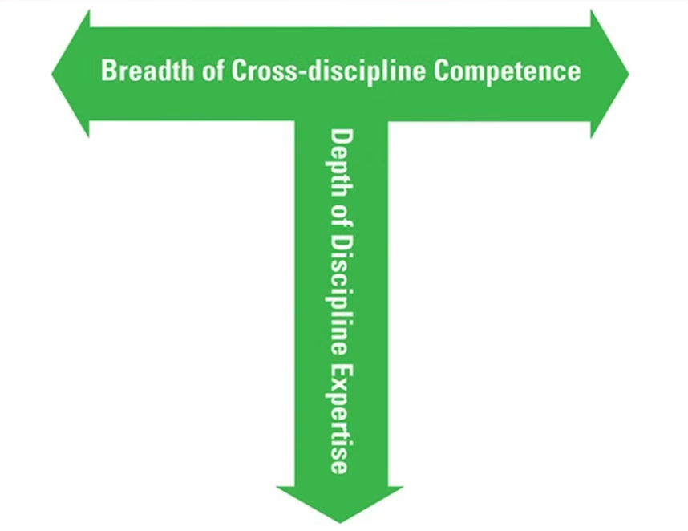
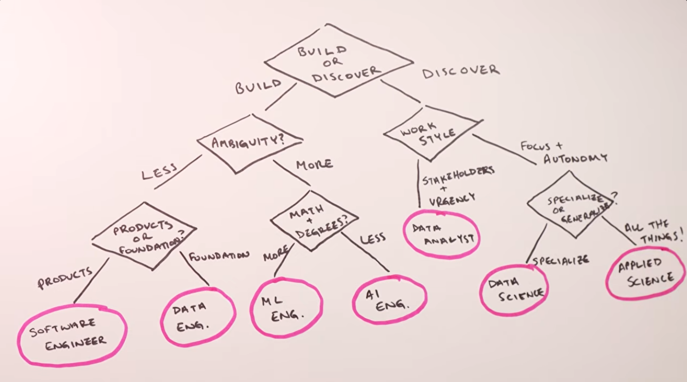

# Grad 2026

## The New Hire

- 💫 [Coding interviews are completely different now (here's why)](https://youtu.be/Do8VuokPbBc?si=cfXNBuLlIPLfh0_Y) by *Marina Wyss*
  - **Mode A:** That AI Arms Race
    - These companies are trying to preserve the "old signals" while trying not to be "tricked" into a hire because of AI
  - **Mode B:** The "AI-Native" Interview
    - Two-stage approach: 1) Take-home assignment where you can use AI, 2) Live pair-programming extension where you have to explain/repair what you built (this is where they are looking at *you* and *your **due-diligence***)
      - Don't "outsource" your thinking!
  - **Mode C:** Show Your Work
    - Your portfolio is your interview prep
    - ***Idea**: What if you used AI to review your public repos? What would it say about your skills/background? How "clean" are your repos (closed issues/pull requests)? Do you have releases? Is the project "abandoned"?*
    - Don't rely on tutorials you "walk through"
  - **Mode D:** ML from scratch
    - Know you algorithms (because many are happening under the hood)
  - What to do? *Ask the recruiter what to expect for the coding round. And push beyond any vague answer.*
  - They are looking for the "T-Shaped Engineer"
      1. Product Thinking
      1. Comfort with abmiguity and chaos
      1. Communication (*"If you can't communicate your thinking, it doesn't matter how good your thinking is."*)

    

- 💫 [Don’t Waste 2026 on the Wrong Career - How to Pick the PERFECT Tech Role](https://youtu.be/_LGYDWBhFbg?si=JSVd2s7hhrIlO8Oa) by *Marina Wyss*

  

- 👍 [You're a REPLACEABLE Backend Developer (here's how to fix it)](https://youtu.be/pi1ib2SfwBU?si=MFWfxDTsjRkF57dZ)
- [LINC Test](https://youtu.be/m7U0353WlrQ?si=vPlpi1C-m5VyXprZ&t=288) + [4 Questions](https://youtu.be/m7U0353WlrQ?si=OLMrNvpLbp-4rBQE&t=467) - Worth seeing the whole video too
- [Companies Are Hiring And Firing At The Same Time. Here's Why.](https://youtu.be/U_kaEifmilo?si=3sbZEaYwC9YG6Vpw)
- [Modern Architecture 101 for New Engineers & Forgetful Experts - Jerry Nixon - NDC Copenhagen 2025](https://youtu.be/WRg13Ze_UpY?si=5vrgjwvwdslfQaXH)
